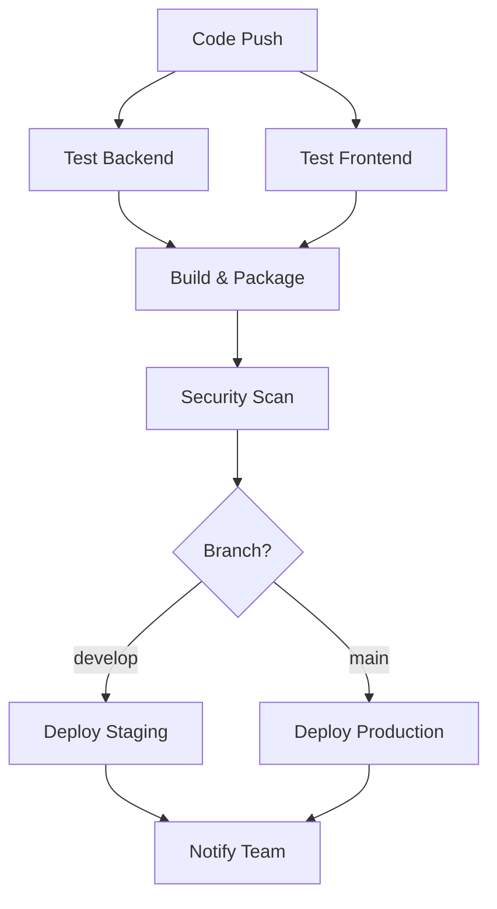

# Deployment Guide - Flag Explorer

This document describes the CI/CD pipeline and deployment processes for the Flag Explorer application.

## Overview

The Flag Explorer application uses a comprehensive CI/CD pipeline with GitHub Actions that includes:

- ✅ **Automated Testing** for both frontend and backend
- ✅ **Security Scanning** with vulnerability detection
- ✅ **Application Building** and optimization
- ✅ **Container Packaging** with Docker
- ✅ **Multi-environment Deployment** (staging/production)
- ✅ **Health Monitoring** and notifications

## Pipeline Architecture



## CI/CD Pipeline Jobs

### 1. Backend Testing (`test-backend`)
- **Python 3.11** environment setup
- **Dependency caching** for faster builds
- **Code linting** with flake8
- **Unit/Integration tests** with pytest
- **Coverage reporting** to Codecov

### 2. Frontend Testing (`test-frontend`)
- **Node.js 18** environment setup
- **NPM dependency caching**
- **ESLint code quality checks**
- **Jest unit tests** with coverage
- **Coverage reporting** to Codecov

### 3. Build and Package (`build-and-package`)
- **Backend packaging** with Python build tools
- **Frontend optimization** with Next.js build
- **Docker image creation** for both services
- **Artifact generation** for deployment
- **Multi-platform support**

### 4. Security Scanning (`security-scan`)
- **Python dependency scanning** with Safety
- **Code vulnerability analysis** with Bandit
- **NPM audit** for frontend dependencies
- **Security report generation**

### 5. Deployment Jobs
- **Staging deployment** (develop branch)
- **Production deployment** (main branch)
- **Environment-specific configurations**
- **Rollback capabilities**

## Local Development

### Prerequisites
- **Docker** and Docker Compose
- **Python 3.11+** with pip
- **Node.js 18+** with npm
- **Git** for version control

### Quick Start
```bash
# Clone the repository
git clone https://github.com/ThabisoPhefo/flag-explorer-app.git
cd flag-explorer-app

# Start with Docker Compose
docker-compose up -d

# Or run locally
# Backend
cd backend
python -m venv venv
source venv/bin/activate
pip install -r requirements.txt
python -m uvicorn app.main:app --host 127.0.0.1 --port 8001

# Frontend (new terminal)
cd frontend
npm install
npm run dev
```

## Container Deployment

### Using Docker Compose
```bash
# Production deployment
docker-compose up -d

# Development with live reload
docker-compose -f docker-compose.yml -f docker-compose.dev.yml up
```

### Individual Container Builds
```bash
# Backend
docker build -t flag-explorer-backend:latest ./backend

# Frontend
docker build -t flag-explorer-frontend:latest ./frontend
```

## Kubernetes Deployment

### Prerequisites
- Kubernetes cluster (>= 1.20)
- kubectl configured
- Helm 3.x (optional)

### Basic Deployment
```bash
# Apply Kubernetes manifests
kubectl apply -f k8s/

# Or using Helm
helm install flag-explorer ./helm-chart
```

### Environment Configuration
```yaml
# k8s/configmap.yaml
apiVersion: v1
kind: ConfigMap
metadata:
  name: flag-explorer-config
data:
  NEXT_PUBLIC_API_URL: "https://api.flagexplorer.com"
  ENVIRONMENT: "production"
```

## Environment Variables

### Backend Environment Variables
```bash
ENVIRONMENT=production
PYTHONPATH=/app
CORS_ORIGINS=["http://localhost:3000", "https://flagexplorer.com"]
```

### Frontend Environment Variables
```bash
NODE_ENV=production
NEXT_PUBLIC_API_URL=http://backend:8001
NEXT_TELEMETRY_DISABLED=1
```

## Monitoring and Health Checks

### Health Endpoints
- **Backend**: `http://backend:8001/health`
- **Frontend**: `http://frontend:3000` (homepage check)

### Monitoring Stack
```bash
# Add monitoring with Prometheus and Grafana
docker-compose -f docker-compose.yml -f docker-compose.monitoring.yml up
```

## Deployment Strategies

### Blue-Green Deployment
```bash
# Deploy to staging environment
kubectl apply -f k8s/staging/

# Smoke test
curl -f https://staging.flagexplorer.com/health

# Promote to production
kubectl apply -f k8s/production/
```

### Rolling Updates
```bash
# Update deployment with zero downtime
kubectl set image deployment/flag-explorer-backend \
  backend=flag-explorer-backend:v2.0.0

kubectl set image deployment/flag-explorer-frontend \
  frontend=flag-explorer-frontend:v2.0.0
```

## Security Considerations

### Container Security
- **Non-root users** in containers
- **Multi-stage builds** to reduce attack surface
- **Security scanning** in CI pipeline
- **Dependency vulnerability checks**

### Network Security
- **HTTPS/TLS termination** at load balancer
- **Network policies** for pod-to-pod communication
- **CORS configuration** for cross-origin requests

## Troubleshooting

### Common Issues

#### Build Failures
```bash
# Clear Docker build cache
docker builder prune

# Rebuild without cache
docker-compose build --no-cache
```

#### Deployment Issues
```bash
# Check pod logs
kubectl logs -f deployment/flag-explorer-backend
kubectl logs -f deployment/flag-explorer-frontend

# Check service endpoints
kubectl get endpoints
```

#### Performance Issues
```bash
# Monitor resource usage
kubectl top pods
kubectl top nodes

# Check application metrics
curl http://backend:8001/metrics
```

## Backup and Recovery

### Database Backup (if applicable)
```bash
# Create backup
kubectl exec deployment/database -- pg_dump flagexplorer > backup.sql

# Restore backup
kubectl exec -i deployment/database -- psql flagexplorer < backup.sql
```

### Configuration Backup
```bash
# Export all configurations
kubectl get all,configmaps,secrets -o yaml > cluster-backup.yaml
```

## Contributing to Deployment

### Adding New Environments
1. Create environment-specific configurations
2. Update pipeline YAML with new deployment job
3. Add environment secrets in GitHub
4. Test deployment in staging first

### Modifying Pipeline
1. Update `.github/workflows/ci-cd.yml`
2. Test changes in feature branch
3. Monitor pipeline execution
4. Document any new requirements

## Support

For deployment issues:
- **Check logs**: Application and container logs
- **Monitor health**: Use health check endpoints
- **Review metrics**: Performance and resource usage
- **Contact team**: For complex deployment issues

---

**Last Updated**: $(date)  
**Pipeline Version**: 1.0.0  
**Supported Platforms**: Docker, Kubernetes, AWS, GCP, Azure 